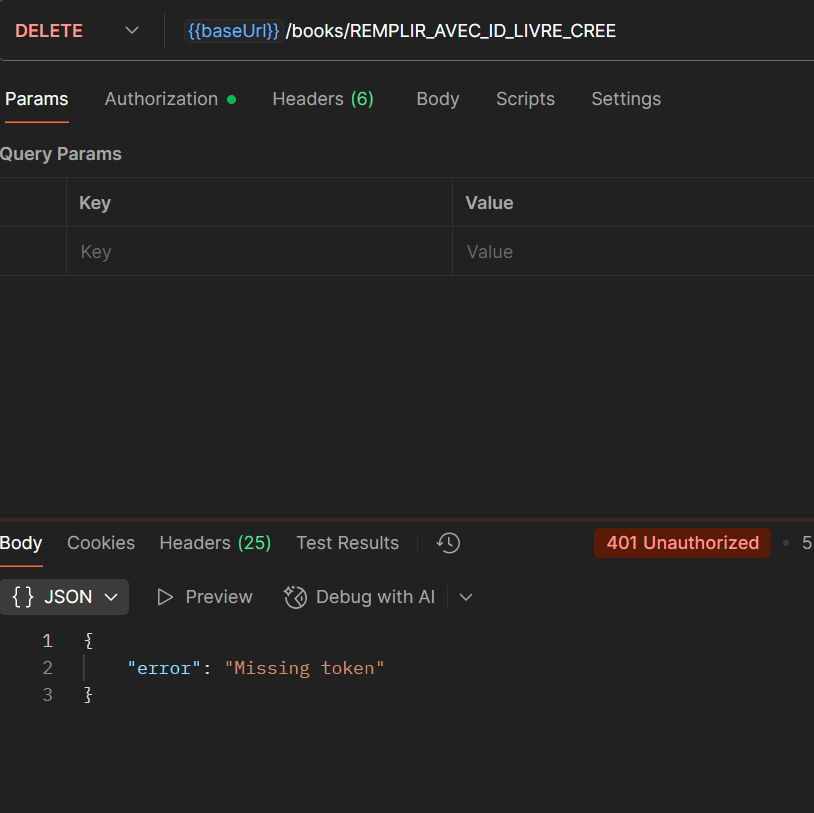
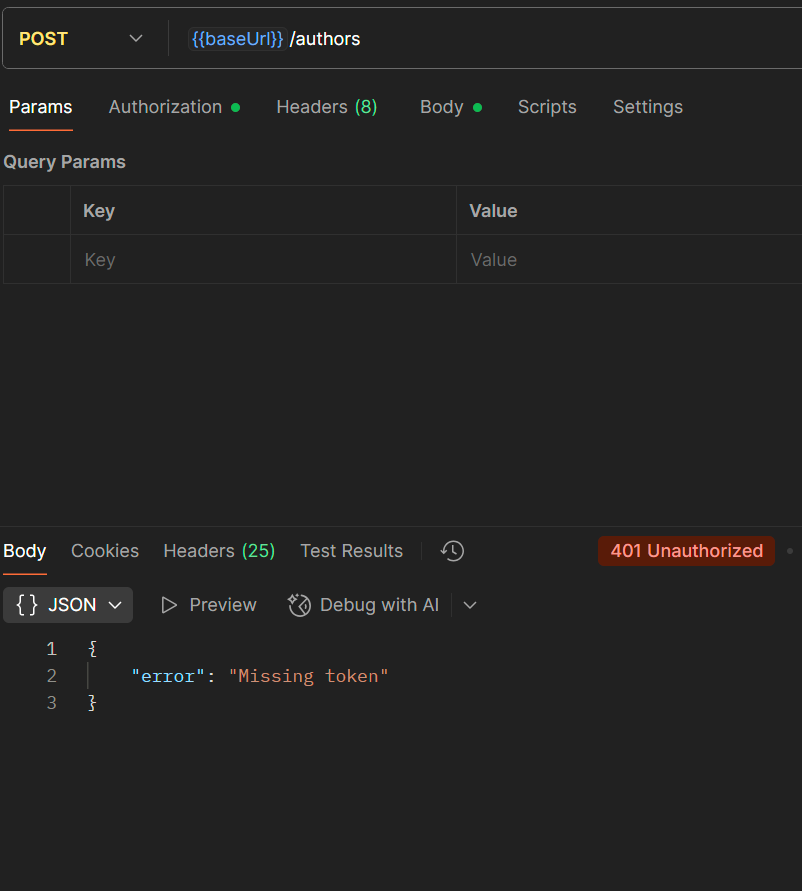

L'authentification est gérée par des tokens JWT. Les utilisateurs s'inscrivent (/register) et se connectent (/login). Le login réussit renvoie un accessToken.
Un middleware auth.js vérifie que ce token est présent et valide dans l'en-tête Authorization: Bearer <token> avant d'autoriser l'accès aux routes protégées.
Une requête vers une route protégée sans token (ou avec un token invalide) renvoie bien une erreur 401 Unauthorized
Les mots de passe des utilisateurs ne sont jamais stockés en clair dans la base de données.Pour prévenir les attaques par force brute (essayer plein de mots de passe) ou par déni de service (DDoS).utilise express-rate-limit pour : Mettre une limite globale sur toute l'API.une limite plus stricte sur la route /auth/login. 
express-validator pour vérifier le body des requêtes (ex: POST /register, POST /books). Je vérifie que l'email est un email valide, que le mot de passe a une longueur minimale, etc.
le middleware cors pour autoriser explicitement une seule origine à parler à mon API.
J'utilise morgan pour enregistrer un journal (log) de toutes les requêtes reçues en console.

